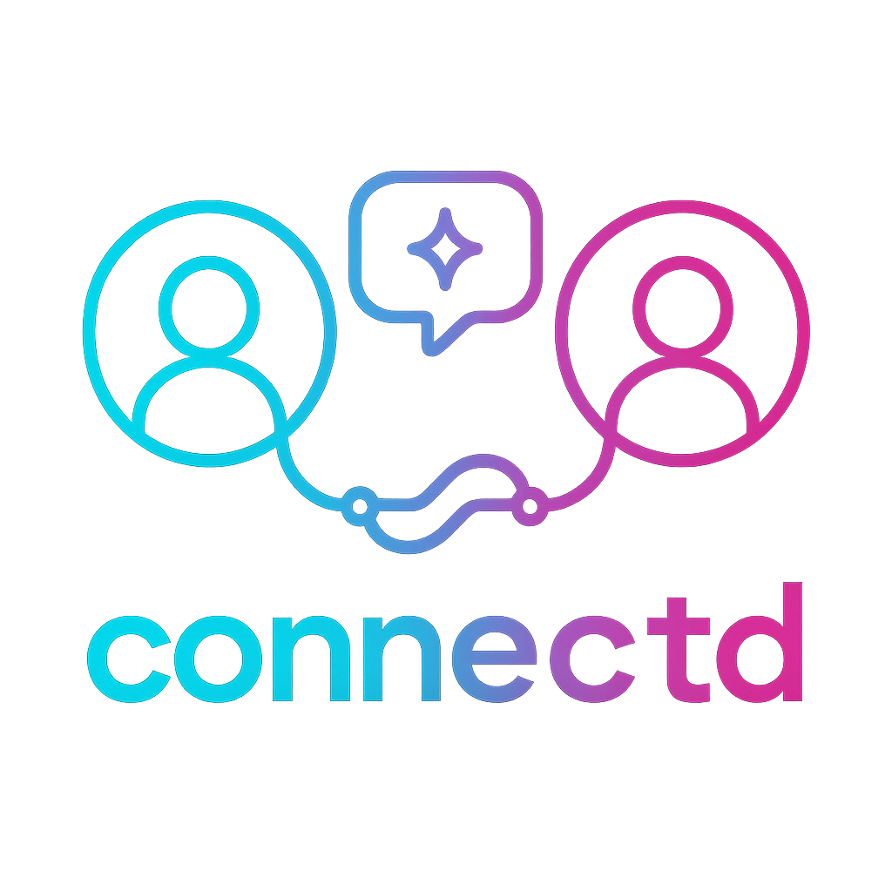

# connectd

<p align="center">
  
</p>

a daemon that finds isolated builders with aligned values and connects them.

**this is not networking. this is community building.**

## the mission

i was lost for 10 years. medicated. numbed. convinced something was wrong with me. nobody told me there was another way.

connectd isn't just finding builders. it's finding the people who don't know they CAN build. the ones who gave up. the ones still stuck in the old system. the ones who need someone to show them the door exists.

we lift them up. we show them what's possible. we connect them to people who GET IT.

## what it does

1. **scouts** - discovers humans across platforms (github, reddit, mastodon, lemmy, discord, lobsters, bluesky, matrix)
2. **analyzes** - scores them for values alignment AND lost builder potential
3. **matches** - pairs aligned builders together, or pairs lost builders with inspiring active ones
4. **drafts** - uses LLM to write genuine, personalized intros
5. **delivers** - sends via email, mastodon DM, bluesky DM, matrix DM, discord DM, or github issue

fully autonomous. no manual review. self-sustaining pipe.

## values it looks for

- privacy, selfhosted, foss
- solarpunk, cooperative, decentralized
- queer-friendly, anti-capitalist
- remote work, work-life balance
- community over competition

## lost builder signals

people who have potential but haven't started yet, gave up, or are struggling:

- "gave up coding", "burned out", "imposter syndrome"
- active in career-help communities but not shipping
- enthusiasm for others' work but no projects of their own
- aspirational bios ("learning...", "aspiring...")

lost builders don't get matched to each other (both need energy). they get matched to ACTIVE builders who can inspire them.

## quick start

```bash
# clone
git clone https://github.com/sudoxnym/connectd
cd connectd

# configure
cp .env.example .env
# edit .env with your API keys

# run with docker
docker compose up -d

# or run directly
pip install -r requirements.txt
python daemon.py --dry-run  # preview mode
python daemon.py            # live mode
```

## cli commands

```bash
# discovery
python cli.py scout                    # all platforms
python cli.py scout --github           # github only
python cli.py scout --reddit --lemmy   # specific platforms
python cli.py scout --user octocat     # deep scrape one user

# matching
python cli.py match                    # find matches
python cli.py match --lost             # find matches for lost builders
python cli.py match --mine             # your matches (if you set up profile)

# intros
python cli.py intro --dry-run          # preview intros
python cli.py intro                    # generate and queue
python cli.py intro --lost             # lost builder intros

# lost builders
python cli.py lost                     # show lost builders
python cli.py lost --verbose           # show the philosophy

# daemon
python cli.py daemon                   # run continuous
python cli.py daemon --dry-run         # preview mode
python cli.py daemon --oneshot         # run once then exit

# status
python cli.py status                   # show stats
```

## docker

```bash
# build
docker build -t connectd .

# run daemon
docker compose up -d

# run one-off commands
docker compose run --rm connectd python cli.py scout
docker compose run --rm connectd python cli.py status
```

## environment variables

copy `.env.example` to `.env` and fill in your values:

```bash
cp .env.example .env
```

### required

| variable | description |
|----------|-------------|
| `GROQ_API_KEY` | for LLM intro drafting ([get one here](https://console.groq.com)) |

### discovery sources

| variable | description |
|----------|-------------|
| `GITHUB_TOKEN` | higher rate limits for github API |
| `DISCORD_BOT_TOKEN` | discord bot token for server access |
| `DISCORD_TARGET_SERVERS` | comma-separated server IDs to scout |
| `LEMMY_INSTANCE` | your lemmy instance (e.g. `lemmy.ml`) |
| `LEMMY_USERNAME` | lemmy username for auth |
| `LEMMY_PASSWORD` | lemmy password for auth |

### delivery methods

| variable | description |
|----------|-------------|
| `MASTODON_TOKEN` | mastodon access token |
| `MASTODON_INSTANCE` | your mastodon instance (e.g. `mastodon.social`) |
| `BLUESKY_HANDLE` | bluesky handle (e.g. `you.bsky.social`) |
| `BLUESKY_APP_PASSWORD` | bluesky app password |
| `MATRIX_HOMESERVER` | matrix homeserver URL |
| `MATRIX_USER_ID` | matrix user ID (e.g. `@bot:matrix.org`) |
| `MATRIX_ACCESS_TOKEN` | matrix access token |
| `SMTP_HOST` | email server host |
| `SMTP_PORT` | email server port (default 465) |
| `SMTP_USER` | email username |
| `SMTP_PASS` | email password |
| `FROM_EMAIL` | from address for emails |

you need at least ONE delivery method configured for intros to be sent.

## architecture

```
scoutd/     - discovery modules (one per platform)
matchd/     - matching + fingerprinting logic
introd/     - intro drafting + delivery
db/         - sqlite storage
config.py   - central configuration
daemon.py   - continuous runner
cli.py      - command line interface
```

## intervals (daemon mode)

- scout: every 4 hours
- match: every 1 hour
- stranger intros: every 2 hours (max 20/day)
- lost builder intros: every 6 hours (max 5/day)

## forking

this is meant to be forked. clone it, set your own values in `scoutd/signals.py`, point it at your communities, run it.

the goal is a self-sustaining pipe that finds YOUR people. the ones who share YOUR values. and connects them.

## license

MIT - do whatever you want with it. just pay it forward.

---

*"you're not behind. you're just not started yet."*
